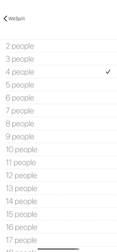

# Group-Tip-Calculator
iOS App: Tip calculator that lets the user enter the amount, number of people to split the bill, tip amount, and update display with amount per person and amount total.

 ___
 ___

## Built with:
* Swift
* SwiftUI
* Code refactoring
* Dark mode enabled
